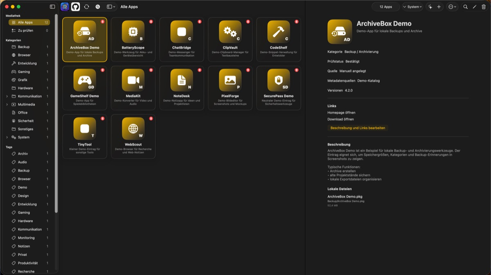
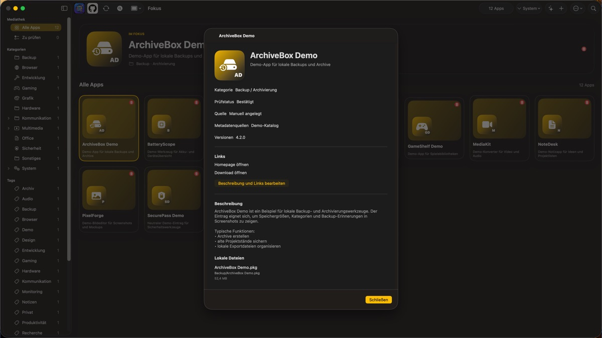
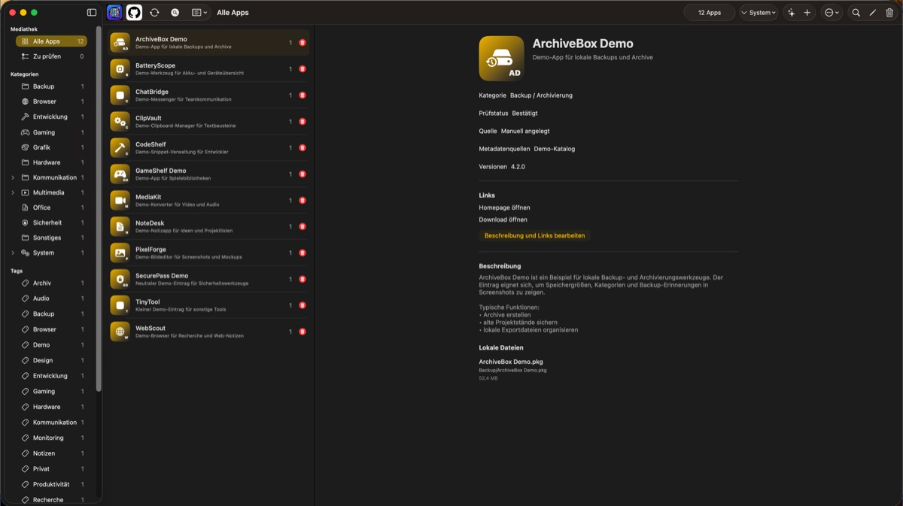
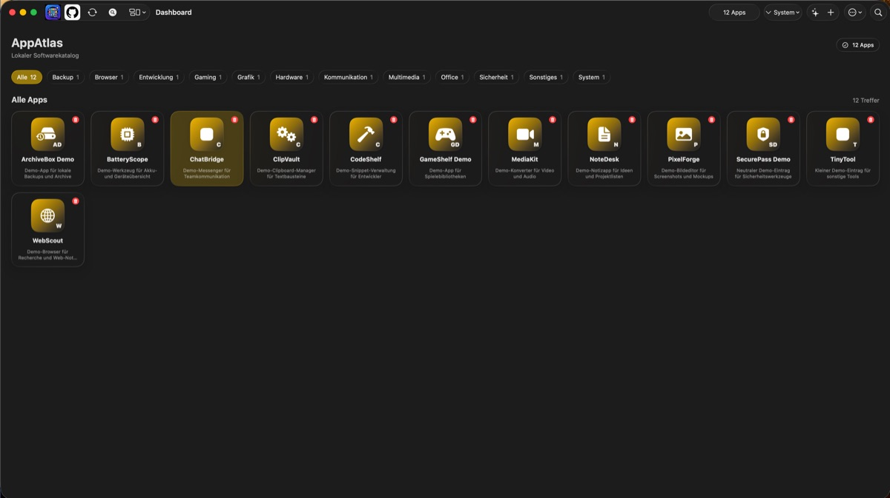

# AppAtlas

[English](README.md)

<p align="center">
  
</p>

AppAtlas ist eine native, datenschutzorientierte SwiftUI-App für macOS. Sie
ordnet persönliche App-Sammlungen aus frei wählbaren Ordnern und verwaltet
Icons, Beschreibungen, Links, Tags, Lizenzinformationen und lokale
Katalogexporte.

> Aktueller Release: **AppAtlas 1.2.0**

[AppAtlas 1.2.0 herunterladen](https://github.com/Schrotty74/AppAtlas/releases/download/v1.2.0/AppAtlas-1.2.0-macos.dmg)

## Funktionen

- Frei wählbare Ordner rein lesend scannen und technische Daten sowie typische
  Backup-Archive herausfiltern.
- Lokale Ordner und selbst definierte Dateiendungen dauerhaft vom Scan
  ausschließen.
- Neue, geänderte und entfernte Dateien bei erneuten Scans mit dem Katalog
  abgleichen.
- Apps manuell hinzufügen, bearbeiten und löschen.
- Apps mit eigenen Tags markieren und über die Sidebar oder Suche filtern.
- Lokale App-Dateien nur nach ausdrücklicher Bestätigung in den Papierkorb
  legen.
- Beschreibungen, Links und hochwertige Icons verwalten.
- Fehlende Metadaten bewusst über „Katalog aktualisieren“ ergänzen.
- Unsichere Treffer mit Quellenangabe unter „Zu prüfen“ bestätigen oder
  verwerfen.
- Online-Abfragen, Parallelität und erweiterte Suche lokal konfigurieren.
- Website-Rückfragen pro App über eine Ausschlussliste verwalten.
- Fremdsprachige Beschreibungen vor dem Speichern lokal übersetzen.
- Icons lokal als separate Originale und schnelle Vorschaubilder speichern.
- Apps über Namen, Beschreibungen, Kategorien, Ordner und Tags durchsuchen.
- Hierarchische Kategorien und Unterordner verwenden.
- App-Assistent mit optionaler Reddit-Recherche.
- Themes importieren, exportieren und löschen.
- Native Liquid-Glass-Effekte für Bedienelemente und Karten ab macOS 26 mit
  kompatibler Darstellung auf älteren macOS-Versionen.
- Katalog als JSON exportieren und importieren, wahlweise ohne Lizenzdaten,
  unverschlüsselt oder passwortgeschützt mit AES-256-GCM.
- Konfigurierbare Backup-Erinnerung für regelmäßige Katalogexporte.
- Katalogstatistik mit Kategorien, Speicherbedarf und fehlenden Metadaten.
- Lizenzdaten aus JSON- und CSV-Dateien importieren.
- Private Lizenzdaten im macOS-Schlüsselbund speichern.
- Einzelne Apps oder den gesamten Katalog löschen.
- Datensparsamen Fehlerbericht für E-Mail oder Codex erstellen.
- Deutsche und englische Oberfläche.

## Screenshots

Die folgenden Screenshots zeigen ausschließlich Demo-Daten.

<table>
  <tr>
    <td width="50%">
      
      <br><sub>Klassische Ansicht</sub>
    </td>
    <td width="50%">
      
      <br><sub>Fokusansicht</sub>
    </td>
  </tr>
  <tr>
    <td width="50%">
      
      <br><sub>Kompaktansicht</sub>
    </td>
    <td width="50%">
      
      <br><sub>Dashboard-Ansicht</sub>
    </td>
  </tr>
</table>

## Voraussetzungen

- macOS 14 oder neuer.
- macOS 15 oder neuer für Apples lokale Übersetzungsfunktion.
- Swift 6.

## Build und Installation

Aktuellen Release herunterladen:
[AppAtlas 1.2.0](https://github.com/Schrotty74/AppAtlas/releases/download/v1.2.0/AppAtlas-1.2.0-macos.dmg)

Beim ersten Öffnen zeigt macOS möglicherweise eine Warnung, da AppAtlas nicht
mit einem kostenpflichtigen Apple Developer Account notarisiert ist.

So öffnest du die App trotzdem:

1. Rechtsklick auf die App-Datei.
2. „Öffnen“ wählen.
3. Im erscheinenden Dialog erneut „Öffnen“ beziehungsweise „Trotzdem öffnen“
   anklicken.

Alternativ kannst du unter **Systemeinstellungen -> Datenschutz & Sicherheit**
ganz unten **Trotzdem öffnen** bestätigen.

Für Entwicklungsprüfungen:

```sh
swift test
swift build
```

GitHub Actions führt dieselben Alltagsprüfungen bei jedem Push und Pull
Request aus: `swift build`, `swift test` und `Scripts/privacy-check.sh`. Der
Workflow veröffentlicht nichts, erzeugt keine Tags, lädt keine Build-Artefakte
hoch und führt keine Release-Skripte aus.

Für einen manuell startbaren Entwicklungsstand ohne Beta, ZIP oder Backup:

```sh
./Scripts/build-development.sh
```

Die App liegt anschließend unter `dist/local-test/AppAtlas-Development/AppAtlas.app` und
wird nicht automatisch geöffnet.

Der Beta-Release-Workflow läuft über das Release-Skript:

```sh
./Scripts/create-beta-from-dev.sh 1.2.0-beta.3
```

Build-Artefakte unter `dist/` werden nicht von Git verfolgt. Backups werden
nur auf ausdrückliche Anweisung erstellt. Lokale Git-Prüfungen vor jedem
Commit und Push verhindern zusätzlich die Aufnahme typischer Katalog-,
Export- und Datenbankdateien.

## Dokumentation

- [AppAtlas-Handbuch (Deutsch, PDF)](docs/output/pdf/AppAtlas-Handbuch-DE.pdf)
- [AppAtlas User Manual (English, PDF)](docs/output/pdf/AppAtlas-User-Manual-EN.pdf)
- [Theme-Dokumentation](docs/themes/README.md)
- [Vorlage für eigene Themes](docs/themes/appatlas-theme-template.json)
- [Vollständiges Beispieltheme](docs/themes/example-custom-theme.json)
- [Beispieltheme Herbstglut](docs/themes/example-autumn-ember.json)
- [Beispieltheme Winterfest](docs/themes/example-winter-frost.json)
- [Projektstruktur](docs/PROJECT_STRUCTURE.md)
- [Details zum Datenschutz](docs/PRIVACY.md)
- [Datenschutzaudit für AppAtlas 1.2.0](docs/PRIVACY_AUDIT_2026-07-06.md)

## Transparenz

AppAtlas wurde gemeinsam mit OpenAI Codex konzipiert und programmiert. Auch
der Name **AppAtlas** entstand aus einem Vorschlag von Codex. Das App-Logo
wurde ebenfalls mit Codex erstellt.

## Fehler Melden

Fehlerberichte und Rückfragen können an
[appatlas@mailbox.org](mailto:appatlas@mailbox.org) gesendet werden. AppAtlas
enthält außerdem einen Fehlerbericht-Dialog, der einen datensparsamen Bericht
für eine E-Mail oder zum Einfügen in Codex erstellt.

## Lizenz

AppAtlas steht unter der GNU General Public License Version 3.
