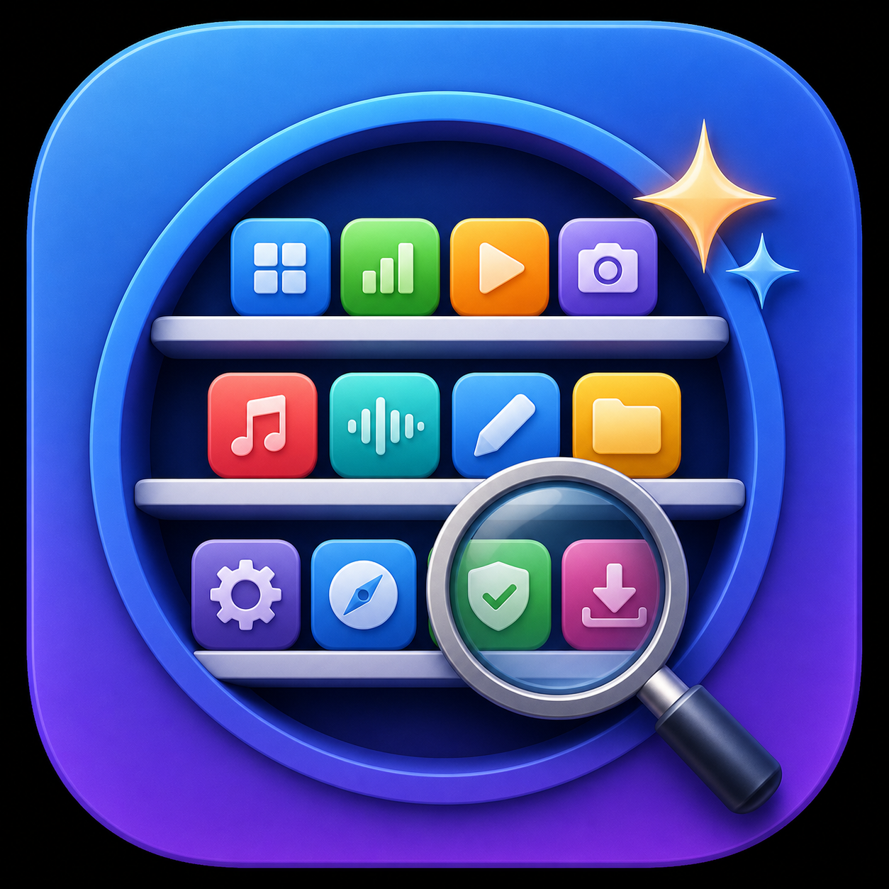

# AppAtlas

<p align="center">
  
</p>

AppAtlas ist eine native, datenschutzorientierte SwiftUI-App für macOS. Sie
ordnet persönliche App-Sammlungen aus frei wählbaren Ordnern, verwaltet Icons,
Beschreibungen, Links und Lizenzinformationen und startet für jeden Benutzer
mit einem leeren lokalen Katalog.

> Aktueller Release: **AppAtlas 1.0.0-beta.5**

[AppAtlas 1.0.0-beta.5 herunterladen](https://github.com/Schrotty74/AppAtlas/releases/download/v1.0.0-beta.5/AppAtlas-1.0.0-beta.5-macos.zip)

## Transparenz

AppAtlas wurde gemeinsam mit OpenAI Codex konzipiert und programmiert. Auch
der Name **AppAtlas** entstand aus einem Vorschlag von Codex. Das App-Logo
wurde ebenfalls mit Codex erstellt.

## Funktionen

- frei wählbare Ordner rein lesend scannen, technische Daten und typische
  Backup-Archive herausfiltern und Vorschläge einzeln auswählen
- lokale Ordner und selbst definierte Dateiendungen dauerhaft vom Scan
  ausschließen
- Apps manuell hinzufügen, bearbeiten und löschen
- Beschreibungen, Links und hochwertige Icons verwalten
- fehlende Metadaten bewusst über „Katalog aktualisieren“ ergänzen
- unsichere Treffer mit Quellenangabe unter „Zu prüfen“ bestätigen oder
  verwerfen
- fremdsprachige Beschreibungen vor der Übernahme lokal übersetzen
- Icons lokal als separate Originale und schnelle Vorschaubilder speichern
- mehrere Layouts und eigenes Theme-System
- natives Liquid Glass unter macOS 26 mit kompatibler Darstellung auf
  älteren macOS-Versionen
- Katalog als JSON exportieren und importieren, optional mit Lizenzdaten
- private Lizenzdaten im macOS-Schlüsselbund speichern
- deutsche und englische Oberfläche

## Voraussetzungen

- macOS 14 oder neuer
- macOS 15 oder neuer für Apples lokale Übersetzungsfunktion

## Themes und Projektstruktur

- [Theme-Dokumentation](docs/themes/README.md)
- [Vorlage für eigene Themes](docs/themes/appatlas-theme-template.json)
- [Vollständiges Beispieltheme](docs/themes/example-custom-theme.json)
- [Projektstruktur](docs/PROJECT_STRUCTURE.md)

## Hinweis zur macOS-Sicherheitswarnung

Beim ersten Öffnen zeigt macOS möglicherweise eine Warnung, da AppAtlas nicht
mit einem kostenpflichtigen Apple Developer Account notarisiert ist.

So öffnest du die App trotzdem:

1. Rechtsklick auf die App-Datei.
2. „Öffnen“ wählen.
3. Im erscheinenden Dialog erneut „Öffnen“ beziehungsweise „Trotzdem öffnen“
   anklicken.

Alternativ kannst du unter **Systemeinstellungen → Datenschutz & Sicherheit**
ganz unten **Trotzdem öffnen** bestätigen.

### macOS Security Warning

When opening AppAtlas for the first time, macOS may display a warning because
the app is not notarized with a paid Apple Developer account.

To open the app anyway:

1. Right-click the app file.
2. Select **Open**.
3. Click **Open** or **Open Anyway** in the dialog that appears.

Alternatively, open **System Settings → Privacy & Security** and confirm
**Open Anyway** at the bottom of the page.

## Datenschutz

Neue Benutzer starten mit einem leeren Katalog. Persönliche Kataloge,
Scanlisten und Importdateien sind kein Bestandteil des Projekts oder der App.
Seriennummern und weitere private Lizenzdaten werden im macOS-Schlüsselbund
gespeichert. Beim Export entscheidet der Benutzer ausdrücklich, ob sie nicht,
passwortgeschützt oder unverschlüsselt enthalten sein sollen.
Onlinequellen werden ausschließlich nach einem bewussten Klick auf
„Katalog aktualisieren“ abgefragt.

Details: [docs/PRIVACY.md](docs/PRIVACY.md)

Öffentlicher Prüfbericht:
[Datenschutzaudit vom 13. Juni 2026](docs/PRIVACY_AUDIT_2026-06-13.md)

## Fehler melden

Fehlerberichte und Rückfragen können an
[appatlas@mailbox.org](mailto:appatlas@mailbox.org) gesendet werden. AppAtlas
enthält außerdem einen Fehlerbericht-Dialog, der einen datensparsamen Bericht
für eine E-Mail oder zum Einfügen in Codex erstellt.

## Entwicklung

```sh
swift test
APPATLAS_ALLOW_RELEASE_PACKAGE=YES ./Scripts/build-beta.sh
```

Das Release-Skript darf nur nach ausdrücklicher Freigabe ausgeführt werden.
Für normale Entwicklungsprüfungen genügen `swift build` und `swift test`; sie
erzeugen keine ZIP-Dateien und öffnen AppAtlas nicht automatisch.

Für einen manuell startbaren Entwicklungsstand ohne Beta, ZIP oder Backup:

```sh
./Scripts/build-development.sh
```

Die App liegt anschließend unter `dist/AppAtlas-Development/AppAtlas.app` und
wird nicht automatisch geöffnet.

Build-Artefakte unter `dist/` werden nicht von Git verfolgt. Backups werden
nur auf ausdrückliche Anweisung erstellt. Lokale Git-Prüfungen vor jedem
Commit und Push verhindern zusätzlich die Aufnahme typischer Katalog-,
Export- und Datenbankdateien.

## Lizenz

AppAtlas steht unter der GNU General Public License Version 3.
