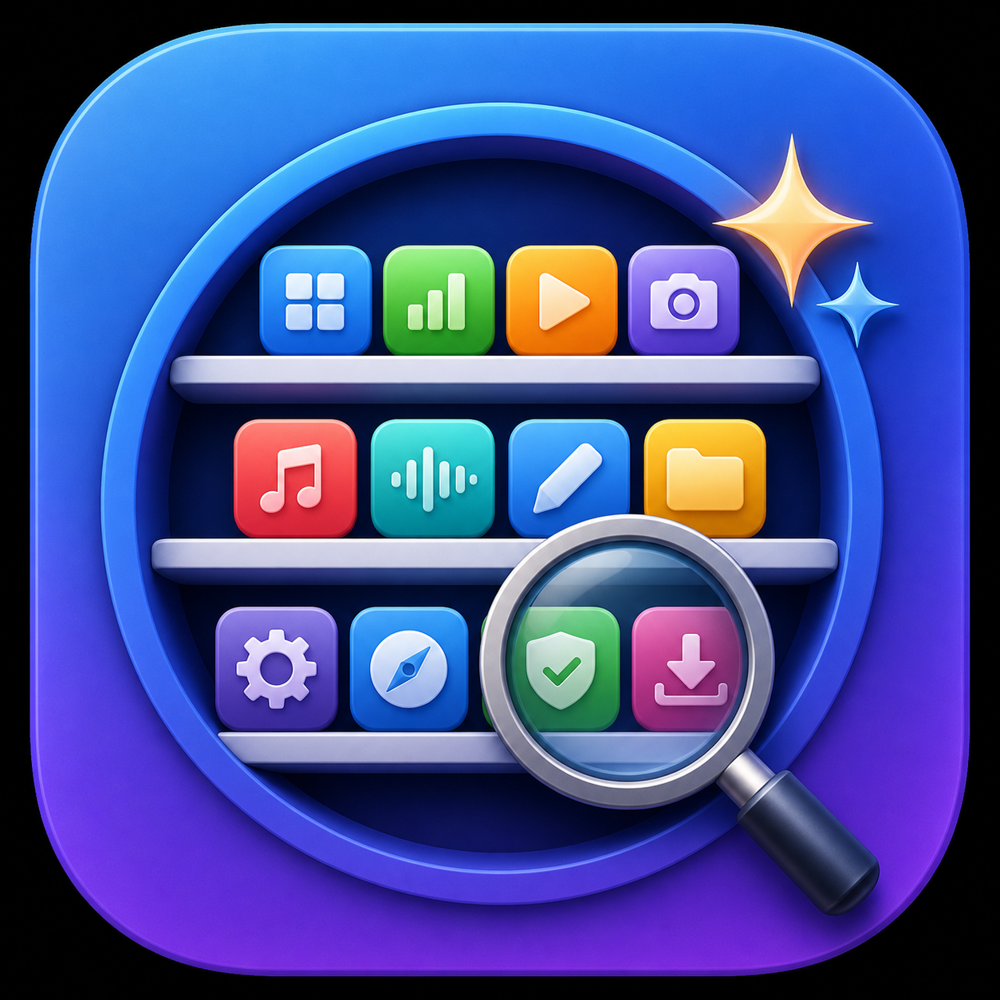

# AppAtlas for macOS – Local App Catalog & Software Organizer

[Deutsch](README.de.md)

AppAtlas is a native, privacy-focused macOS app organizer and local software catalog. It scans user-selected folders and helps manage app descriptions, links, tags, categories, icons, license information, local catalog exports and backups.

> Current release: **AppAtlas 1.2.2**

[Download AppAtlas 1.2.2](https://github.com/Schrotty74/AppAtlas/releases/download/v1.2.2/AppAtlas-1.2.2-macos.dmg)

## Key Features

- Scan freely selected folders in read-only mode and organize personal Mac app collections
- Compare new, changed and removed files on repeated scans
- Search apps by name, description, category, folder and tags
- Manage descriptions, links, high-quality icons and hierarchical categories
- Store private license data in the macOS Keychain
- Import license data from JSON and CSV
- Local Homebrew and Setapp catalog support after explicit updates
- Catalog statistics for categories, storage usage and missing metadata
- JSON catalog import/export with optional AES-256-GCM password protection
- Backup reminders for regular catalog exports
- English and German interface
- Privacy-conscious bug reports and local-first data handling

## Requirements

- macOS 14 or later
- macOS 15 or later for Apple's local translation feature
- Swift 6

## Privacy

AppAtlas is designed around a local catalog. User-selected folders are scanned locally and private license data can be stored in Keychain. Online catalog lookups are configurable and explicit.

## Documentation

- [AppAtlas User Manual (English, PDF)](docs/output/pdf/AppAtlas-User-Manual-EN.pdf)
- [AppAtlas-Handbuch (Deutsch, PDF)](docs/output/pdf/AppAtlas-Handbuch-DE.pdf)
- [Privacy details](docs/PRIVACY.md)

## Community

Questions and feedback are welcome on [Discord](https://discord.gg/RbsvqRCPQ).

## License

AppAtlas is licensed under the GNU General Public License Version 3.
